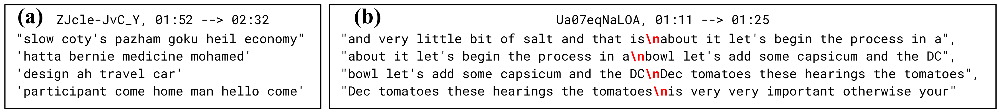

## Sentencify Text

Convert text segments (from Youtube ASR) into full sentences.

Developed for [Temporal Alignment Networks for Long-term Video](https://www.robots.ox.ac.uk/~vgg/publications/2022/Han22a/han22a.pdf). Details described in Appendix A.

---



This module takes as input the ASR texts, and fixes three problems:

1. Incorrect Language Translation. (example (a), original language is Thai).
2. Incorrect linebreaks - resulting in repeatitive text segments. (example (b)).
3. Incorrect Sentence Partition - cut text segments to fix window size (example (b)). 

This module does five things:

1. filter out non-EN languages.
2. remove duplicate text segments.
3. combine text segments into a paragraph, then add punctuations.
4. cut the paragraph into sentences.
5. interpolate ASR timestamps.

---

### Required packages

```
langdetect (https://pypi.org/project/langdetect/)
transformers (huggingface)
joblib
pandas
torch (v1.10, earlier versions might work)
```

### Download the punctuation model [[link]](https://huggingface.co/felflare/bert-restore-punctuation)
```sh
cd sentencify_text
git lfs install
git clone https://huggingface.co/felflare/bert-restore-punctuation
```

### Instruction

Use as a separate python function:

```python
from filters.sentencify import Sentencify

processor = Sentencify() # it will use cuda if torch.cuda.is_available()

# example input data
text_segments = [
    "lay the tomatoes on the tray",
    "and these go into the oven for about 90",
    "minutes if you turn the oven down really",
    "low you can leave them in overnight"]
start_timestamps = [33.45, 36.84, 39.69, 41.67]
end_timestamps =   [39.69, 41.67, 43.77, 45.59]

# transform text segments into complete sentences
sentences, _, _ = processor.punctuate_and_cut(text_segments)
print(sentences)
# >>> ['lay the tomatoes on the tray and these go into the oven for about 90 minutes', 'if you turn the oven down really low you can leave them in overnight']

# can also interpolate the start/end timestamps for output sentences
sentences, new_start, new_end = processor.punctuate_and_cut(text_segments, start_timestamps, end_timestamps)

print(list(zip(sentences, new_start, new_end)))
# >>> [('lay the tomatoes on the tray and these go into the oven for about 90 minutes', 33.45, 40.20), ('if you turn the oven down really low you can leave them in overnight', 40.20, 45.59)]
```

Use to pre-process HowTo100M dataset:

```sh
python process_htm.py  # check process_htm.py for details
```

### Reference

If you find this module useful for your project, please consider citing our paper:
```bibtex
@InProceedings{Han2022TAN,
    author       = "Tengda Han and Weidi Xie and Andrew Zisserman",
    title        = "Temporal Alignment Networks for Long-term Video",
    booktitle    = "CVPR",
    year         = "2022",
}
```